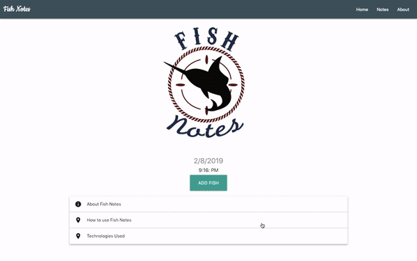

# Fish Notes
>A application that gives anglers a fast and efficient way to log all important information about their fishing trips.

### Preview of fish notes
>

### Technologies Used
- React.JS
- Redux
- Node.JS
- Express
- Javascript
- HTML
- CSS
- SCSS
- Materialize
- GIT

### Project Lead
>Tiffany Kim
- Portfolio https://Tiffanyykim.com/
